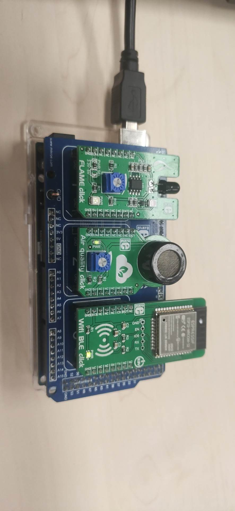

# 1. Configuration de la partie sur la carte Arduino 
- [1. Configuration de la partie sur la carte Arduino](#1-configuration-de-la-partie-sur-la-carte-arduino)
  - [1.1. **Assemblage**](#11-assemblage)
  - [1.2. **Compilation du code**](#12-compilation-du-code)
  - [1.3. **Upload du fichier CodeArduinoCapteurs.ino**](#13-upload-du-fichier-CodeArduinoCapteurs)
  - [1.4. **Vérification**](#14-vérification)

Cette partie permet de configurer et de faire fonctionner les capteurs de flamme et de quantité de CO2 dans l'air. Ces informations seront ensuite envoyées à la carte Lora par l'intermédiaire de la carte wifi.

Matériel nécessaire:
- Carte Arduino MEGA 2560 avec son cable d'alimentation
- Arduino MEGA click SHIELD
- Capteur de flamme "FLAME click" 
- Capteur de qualité d'air "Air quality click" 
- Carte wifi "Wifi BLE click"

**Photo de la maquette Arduino avec les 2 capteurs et la carte Wifi.**

## 1.1. **Assemblage**

Assembler la carte arduino avec son "Arduino MEGA click SHIELD". Puis il faut mettre dans le même ordre que sur la photo, les deux capteurs (flame click et air quality) et la carte wifi.

## 1.2. **Compilation du code**

lancez le logiciel "Arduino IDE.exe" et compiler le fichier "CodeArduinoCapteurs.ino" disponible dans le dossier arduino. S'il n'y a pas d'erreur lors de la compilation, il faut attendre la mise en place de la carte LoRa avant d'upload le code.

On doit attendre tout simplement que le serveur soit fonctionnel sur la carte LoRa afin de s'y connecter avec notre module wifi en tant que client. Pensez donc à mettre en place la partie LoRa avant de passer à l'étape suivante.

## 1.3. **Upload du fichier CodeArduinoCapteurs.ino**

Une fois le serveur up, on peut upload le code sur la carte arduino afin de faire fonctionner les capteurs et la carte wifi.

## 1.4. **Vérification**

Une fois le programme lancé, on vérifie étape par étape en ouvrant le terminal serial sur l'IDE arduino (Tool => Serial monitor). 

Il faut penser à bien mettre le Baudrate à 115200.

les différentes étape que le code effectue lors de la phase d'initialisation:

1°) Set up des connections Serial et Serial3

2°) On test la commande AT | Réponse: ok

3°) Reset de l'ESP32 | Réponse: ok

4°) Choix du mode 1 | Réponse: Ready

5°) Activation des connections multiples | Réponse: ok

6°) Connection au wifi "WifiGRP1" crée par la carte LoRa | Réponse: ok

7°) Ouverture d'une connection TCP instanciée par l'AP | Réponse: ok

8°) La boucle infinie:
En moyenne, on récupère les données des capteurs, on les formate puis on les envois sur le port série 3 toutes les 3 secondes.

Réponse de l'ESP32: "OK" et  "DATA SEND"

