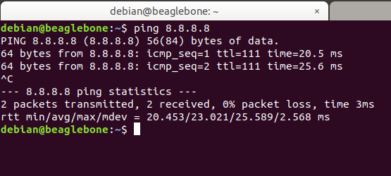

# 1. Configuration Passerelle - BBB

- [1. Configuration Passerelle - BBB](#1-configuration-passerelle---bbb)
  - [1.1. Configuration BeagleBone Black (BBB)](#11-configuration-beaglebone-black-bbb)
    - [1.1.1. **Démarrage**](#111-démarrage)
    - [1.1.2. **Initialisation**](#112-initialisation)
      - [1.1.2.1. **Connexion à la BBB via SSH**](#1121-connexion-à-la-bbb-via-ssh)
      - [1.1.2.2. **Accès internet depuis la BBB**](#1122-accès-internet-depuis-la-bbb)
      - [1.1.2.3. **Préparation de l'appli Python**](#1123-préparation-de-lappli-python)
        - [1.1.2.3.1. **Installation des paquets**](#11231-installation-des-paquets)


## 1.1. Configuration BeagleBone Black (BBB)


</br>

### 1.1.1. **Démarrage**

</br>

Pour commencer, se rendre sur la page web de beagleboard pour y trouver le tuto de configuration de la BeagleBone Black -> [BBone Getting started](https://beagleboard.org/getting-started) 

- Télécharger la dernière image Debian SD IoT de [BBone Getting started](beagleboard.org/latest-images)
- Sortir la carte SD de la BeagleBone Black et la flasher avec l'image préalablement installée (avec BalenaEtcher par exemple)
- Réinsérer la carte SD dans la BBB éteinte 
- Brancher la BBB via USB à une machine tout en pressant le bouton "USER/BOOT" pendant quelques secondes

--> Après quelques minutes, la BeagleBone devrait être UP et fonctionnelle

</br>

### 1.1.2. **Initialisation**

#### 1.1.2.1. **Connexion à la BBB via SSH**

</br>

Une fois UP, la BBB devrait créér une ou deux interfaces réseaux sur la machine en fonction du type d'USB avec les IP **192.168.6.1** et/ou **192.168.7.1**. Les addresses en **.2** seront réservées pour la BBB elle même.</br>
Si les interfaces apparaissent bien, il nous est possible de ping la BBB via son addresse en **.2** et même de se connecter dessus via SSH :

```bash
ssh debian@192.168.X.2 
```
avec X qui correspond à l'IP de l'une des interfaces créés (6 ou 7 dans notre cas)


#### 1.1.2.2. **Accès internet depuis la BBB**

</br>

Par défaut, la BBB n'a pas d'accès à internet et pour remédier à ce problème il nous faut réaliser une "**IP Masquerade**" afin que la BBB utilise la l'interface WIFi de la machine Hôte pour se connecter à internet.</br>
Pour cela, il faut se rendre **sur la machine hôte** afin d'y rajouter des règles IP Tables :

```bash
sudo iptables -t nat -A POSTROUTING -s 192.168.6.0/23 -o X -j MASQUERADE
```
avec X qui correspond à l'interface WIFI (ou filaire) de la machine hôte</br>
Ensuite on ajoute une règle dans dans le fichier sysctl.conf afin d'autoriser le forwarding en décommentant la ligne "**net.ipv4.ip_forward=1**" puis en appliquant les configurations

```bash
sudo nano /etc/sysctl.conf
```


</br>

Une fois cela réalisée, on se rend **sur la BBB** pour y rajouter une route par defaut ainsi qu'une entrée DNS

```bash
sudo ip route add default via 192.168.X.1
```

avec X qui correspond à l'IP de l'une des interfaces créés au départ (6 ou 7 dans notre cas)

```bash
sudo nano /etc/resolv.conf
``` 


</br>

--> **Nous pouvons donc maintenant nous connecter à internet**



#### 1.1.2.3. **Préparation de l'appli Python**

##### 1.1.2.3.1. **Installation des paquets**

</br>

Pour le bon fonctionnement de notre appli python, il nous faut installer des paquets 

```bash
sudo apt update
sudo apt install python3
python3 install pip
pip3 install paho-mqtt
pip3 install requests
```

--> **On peut maintenant lancer notre script python sur la BBB**

```bash
python3 script.py
```

