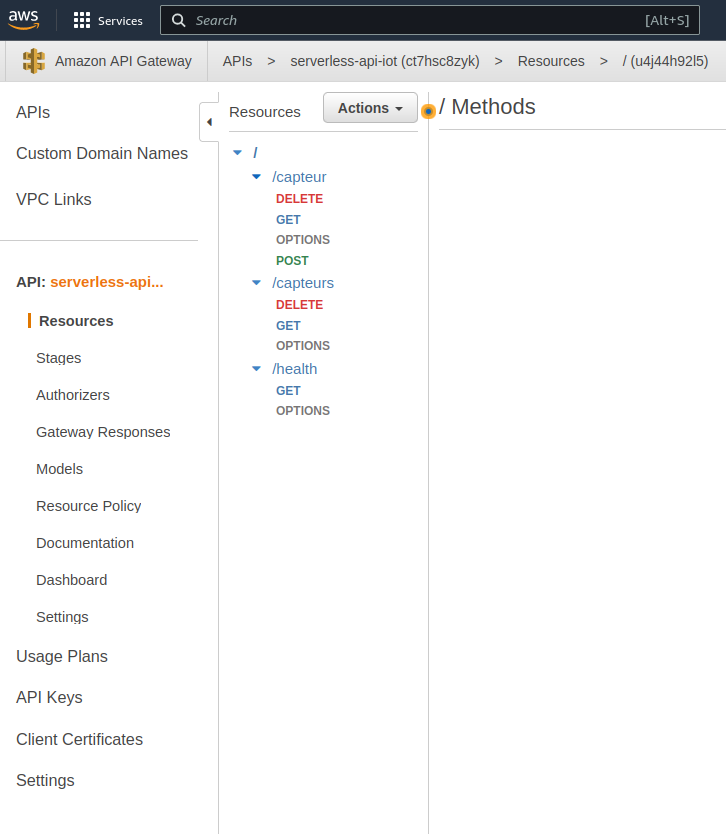
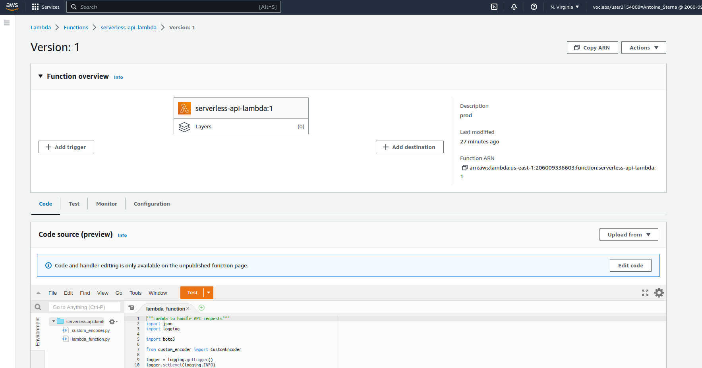
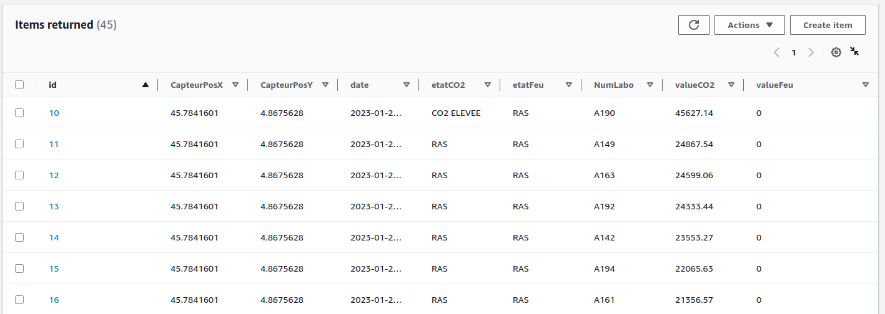

# 1. Configuration Plateforme AWS
- [1. Configuration Plateforme AWS](#1-configuration-plateforme-aws)
  - [1.1. Serverless Infrastructure](#11-serverless-infrastructure)
    - [1.1.1. Schema](#111-schema)
    - [1.1.2. Explication](#112-explication)
    - [1.1.3. Add-on : Topic SNS](#113-add-on--topic-sns)
    - [1.1.4. Annexes: Quelques illustrations](#114-annexes-quelques-illustrations)
      - [1.1.4.1. **Interface API**](#1141-interface-api)
      - [1.1.4.2. **Interface Lambda**](#1142-interface-lambda)
      - [1.1.4.3. **Interface DynamoDB**](#1143-interface-dynamodb)

Pour déployer la configuration minimale si il est souhaité d'utiliser un serveur, le code terraform est dans le dossier "terraform_provisionning", Il permet la création d'un VPC, de subnets, NAT gateway, Internet Gateway et toutes les tables de routages appropriées.

Nous avons décidé de plutot être en mode serverless pour le projet.

## 1.1. Serverless Infrastructure

### 1.1.1. Schema

### 1.1.2. Explication

Le client est dans notre cas, le beaglebone black (cf doc [ici](../3.%20Beaglebone%20config/README.md)).

Il envoit des données via des requetes API à l'API hébergée sur AWS (API Gateway) qui est un service serverless.

Ensuite, les requêtes sont forwardées à une Lambda qui gère toutes les requetes API grâce au code python qu'elle héberge. 

Une fois la requête traitée, si la requete du client est un POST (un souhait d'ajouter des données) la Lambda écrit automatiquement dans une DynamoDB (Encore un service serverless)

La dernière étape est d'ajouter un grafana (ou un kibana) afin de visualier les données sous différents points de vue (Métriques, dashboard, statistiques, graphiques, etc...)

Il est également envisagable de rendre public cette implémentation.

### 1.1.3. Add-on : Topic SNS

Une fois les données récupérées via l'API, nous avons ajouté à la fonction Lambda un topic SNS afin d'envoyer des mails et des sms en fonction d'incendie ou de taux de CO2 trop élévé par exempled.

### 1.1.4. Annexes: Quelques illustrations

#### 1.1.4.1. **Interface API**

#### 1.1.4.2. **Interface Lambda**

#### 1.1.4.3. **Interface DynamoDB**
